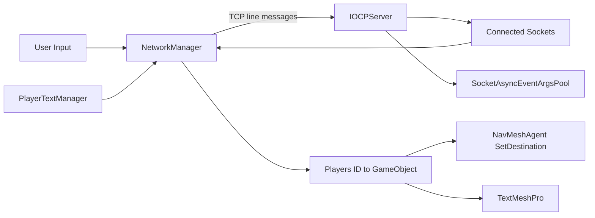
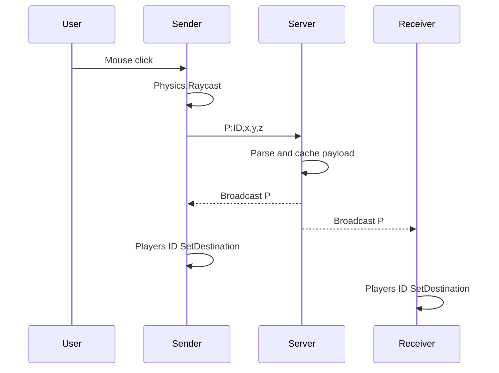

# Architecture

## 범위

이 문서는 선별된 세 소스 파일의 관계를 설명합니다. Scene, Prefab, Unity Package와 팀원 작성 코드는 저장소에 포함하지 않습니다.

## 클래스 책임

| 클래스 | 책임 |
|---|---|
| `IOCPServer` | TCP 연결 수락, Player ID 발급, Receive 처리, 상태 저장, Broadcast, 연결 제거 |
| `SocketAsyncEventArgsPool` | Receive/Send용 `SocketAsyncEventArgs` 생성과 재사용 |
| `NetworkManager` | TCP Client 연결, 입력 수집, 메시지 송수신·파싱, Player 생성과 상태 적용 |
| `PlayerTextManager` | TMP InputField의 채팅 입력과 Disconnect UI 연결 |

## 정적 관계



## 연결과 ID 초기화

1. `NetworkManager.ConnectToServer()`가 `127.0.0.1:8080`에 연결합니다.
2. `IOCPServer.AcceptCompleted()`가 `ID`와 증가 카운터를 조합해 Player ID를 발급합니다.
3. 서버는 `clientIdMap`에 `Player ID → Socket`을 저장합니다.
4. 서버가 `I:ID,0,0,0`을 전송합니다.
5. Client는 첫 `I:` 메시지에서 자신의 `playerID`를 설정합니다.
6. Client가 자신의 Player를 생성하고 초기 좌표를 `P:`로 전송합니다.
7. Client는 `Players`에 `Player ID → GameObject`를 저장합니다.

## 목적지 이동 흐름



서버는 송신자를 Broadcast 대상에서 제외하지 않습니다. 따라서 조작한 Client도 서버가 되돌려 보낸 메시지를 받은 뒤 자신의 Player에 `SetDestination()`을 호출합니다.

## 채팅 흐름

```text
TMP_InputField
→ PlayerTextManager.GetText
→ NetworkManager.SendTextToServer
→ Text:ID,message
→ IOCPServer.ProcessReceive
→ BroadcastMessage
→ NetworkManager.UpdatePlayerText
→ Player child TextMeshPro
```

말풍선 표시와 자동 숨김은 팀원 작성 `PlayerMove` 기능이므로 이 저장소의 선별 코드에는 포함하지 않습니다.

## Late Join 초기화

서버는 수신한 `P:` payload를 `clientPositions`에 저장합니다. 새 Client가 연결되면 `SendAllPositionsToClient()`가 저장된 ID와 payload를 `I:` 메시지로 전달합니다.

```text
Existing Client P payload
→ clientPositions
→ New Client Accept
→ SendAllPositionsToClient
→ I:ExistingID,x,y,z
→ CreateOtherPlayer
```

목적지 기반 구조에서는 저장 값이 실제 현재 위치가 아니라 마지막 목적지일 수 있습니다. 자세한 내용은 `Limitations.md`에 기록합니다.

## 외부 의존성

| 의존성 | 사용 위치 | 저장소 처리 |
|---|---|---|
| Unity `MonoBehaviour`, Input, Physics, Camera | `NetworkManager` | 코드 타입 참조만 유지 |
| `NavMeshAgent` | Player 생성과 이동 적용 | 코드 타입 참조만 유지 |
| TextMeshPro | 채팅 입력·표시 | 코드 타입 참조만 유지 |
| `playerPrefab`과 Scene 연결 | `NetworkManager` serialized field | Prefab과 Scene 미포함 |
| .NET Socket API | `Program.cs` | 표준 라이브러리 의존성 |
