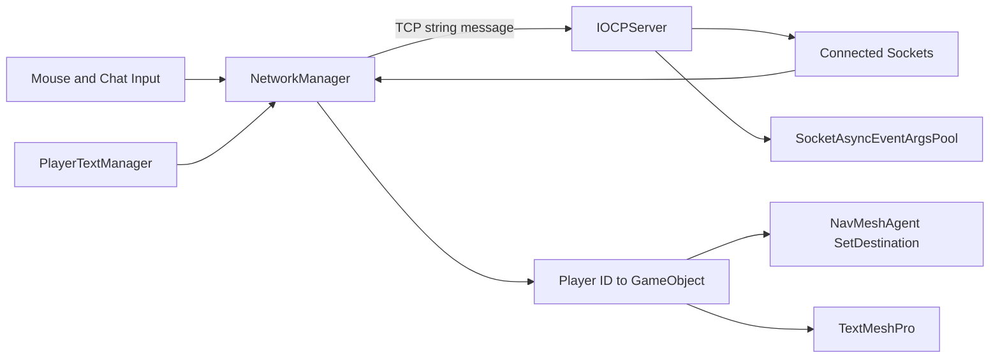
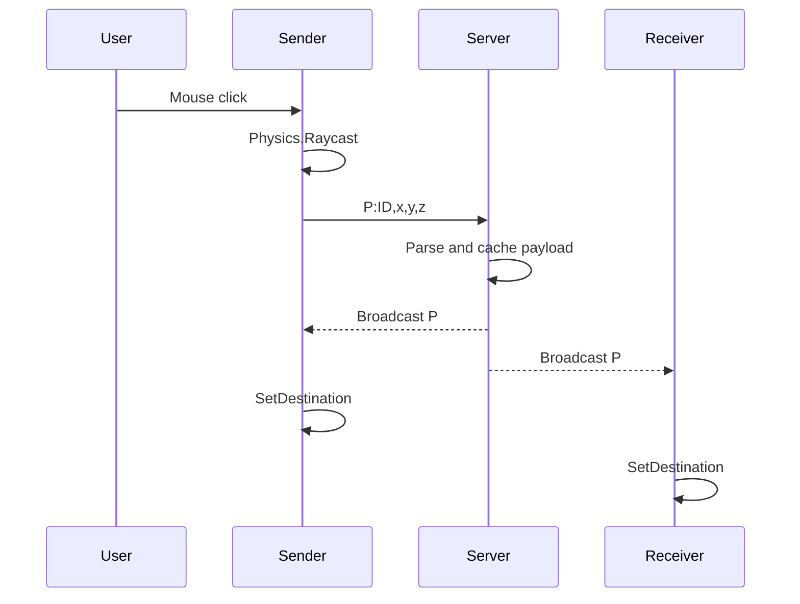

# Architecture

제가 구현한 구조는 Unity Client가 TCP Server에 메시지를 보내고, Server가 연결된 Client에 같은 메시지를 전달하는 형태입니다.

```text
Client Input
→ TCP Server
→ Broadcast
→ Client Message Handler
→ Player
```

## 담당 클래스

| 클래스 | 구현 내용 |
|---|---|
| `IOCPServer` | 연결 수락, Player ID 발급, Receive, 상태 저장, Broadcast, 연결 제거 |
| `SocketAsyncEventArgsPool` | Receive와 Send에 사용할 `SocketAsyncEventArgs` 생성·재사용 |
| `NetworkManager` | TCP 연결, 입력 수집, 메시지 송수신·파싱, Player 생성과 이동 적용 |
| `PlayerTextManager` | 채팅 입력과 Disconnect UI 연결 |

## 클래스 관계



## Connection과 Player ID

1. `NetworkManager.ConnectToServer()`가 `127.0.0.1:8080`에 접속합니다.
2. 서버의 `AcceptCompleted()`에서 Player ID를 발급합니다.
3. 서버는 `clientIdMap`에 `Player ID → Socket` 관계를 저장합니다.
4. 서버가 `I:ID,0,0,0` 메시지를 Client에 보냅니다.
5. Client는 첫 `I:` 메시지의 ID를 자신의 `playerID`로 사용합니다.
6. Client가 자신의 Player를 생성하고 초기 좌표를 `P:`로 보냅니다.
7. Client는 `Players`에 `Player ID → GameObject` 관계를 저장합니다.

Player ID를 기준으로 서버에서는 Socket을, Client에서는 GameObject를 찾을 수 있도록 구성했습니다.

## Destination 이동



마우스를 클릭하면 `Physics.Raycast`로 지면 좌표를 구하고 `P:` 메시지에 담아 보냅니다. 서버는 이 메시지를 저장한 뒤 모든 Client에 전달합니다. 송신 Client도 서버가 돌려준 메시지를 받은 다음 자신의 Player에 `SetDestination()`을 호출합니다.

## Chat

```text
TMP_InputField
→ PlayerTextManager.GetText
→ NetworkManager.SendTextToServer
→ Text:ID,message
→ IOCPServer.ProcessReceive
→ BroadcastMessage
→ NetworkManager.UpdatePlayerText
→ Player TextMeshPro
```

이동과 채팅은 같은 TCP 연결과 Broadcast 흐름을 사용하고, 메시지 Type으로 처리 방식을 구분했습니다.

## Late Join

서버는 마지막으로 받은 `P:` payload를 `clientPositions`에 저장합니다. 새로운 Client가 접속하면 저장된 ID와 좌표를 `I:` 메시지로 보내 기존 Player를 생성합니다.

목적지 동기화로 변경한 이후에는 저장된 값이 실제 현재 위치가 아니라 마지막 목적지일 수 있습니다. 이 때문에 이동 중 접속한 Client가 Player를 실제 위치가 아닌 목적지에서 생성할 수 있다는 한계가 있습니다.

## 코드 외부 의존성

| 의존성 | 코드에서의 역할 |
|---|---|
| Unity Input, Physics, Camera | 클릭 입력과 Raycast |
| `NavMeshAgent` | 목적지 기반 이동 |
| TextMeshPro | 채팅 입력과 표시 |
| `playerPrefab`, Scene | Player 생성과 참조 연결 |
| .NET Socket API | TCP Server와 Client 통신 |

이 저장소에는 제가 작성한 코드를 중심으로 담았기 때문에 Scene, Prefab과 외부 Asset은 포함하지 않았습니다.
