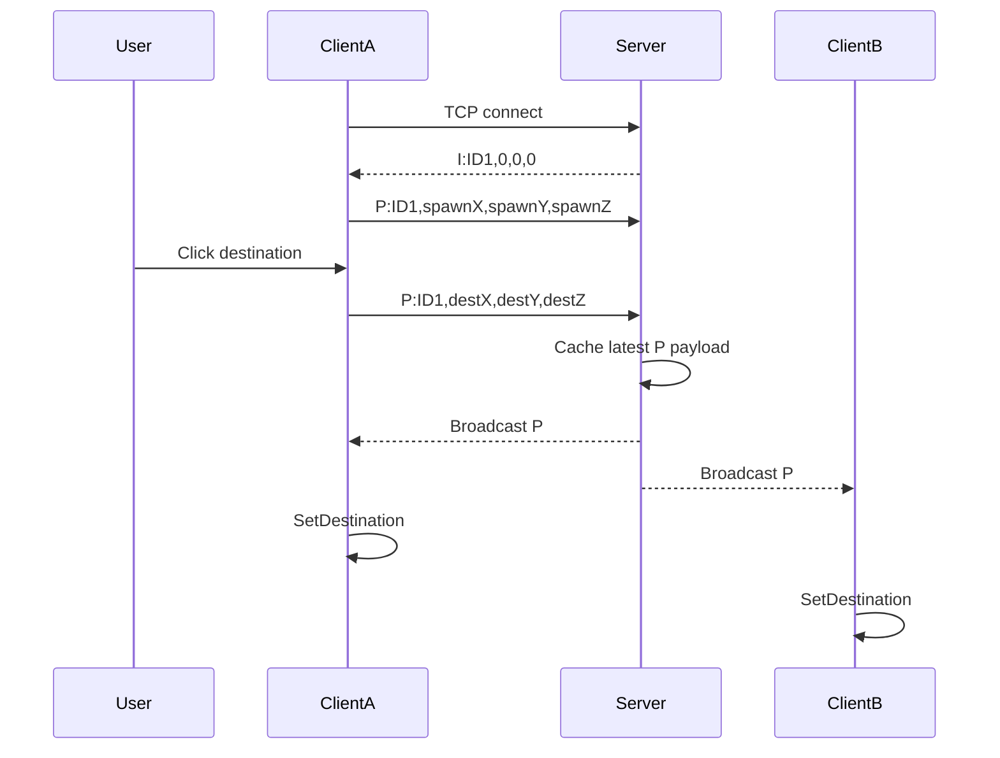

# IOCP Destination Sync

Unity 팀 프로젝트에서 제가 담당한 TCP 서버와 네트워크 클라이언트 코드를 정리한 저장소입니다.

처음에는 Player의 현재 위치를 0.5초마다 서버에 전송했습니다. 구현을 다시 살펴보면서 수신 Client가 이 좌표를 위치 보정에 쓰는 것이 아니라 `NavMeshAgent.SetDestination()`의 목적지로 사용하고 있다는 점을 발견했습니다.

저는 클릭 이동 방식에 맞춰 동기화할 데이터를 현재 위치에서 클릭한 목적지로 바꿨습니다. 전송 시점도 일정 주기의 Coroutine에서 마우스 클릭 이벤트 시점으로 변경했습니다.

> 현재 위치를 반복 전송하는 초기 구현에서 `SetDestination()`을 활용한 목적지 전달 구조로 전환하고, TCP 서버를 거쳐 이동과 채팅을 동기화했습니다.

## 변경 전후

```text
AS-IS
Current Position → every 0.5 seconds → Server → Broadcast → SetDestination

TO-BE
Click Destination → Server → Broadcast → SetDestination
```

`SetDestination()`을 새로 도입한 것이 아니라, 이미 사용하고 있던 이동 방식에 맞춰 송신 데이터의 의미와 전송 시점을 다시 설계한 작업입니다.

별도의 패킷 수나 트래픽 측정은 진행하지 않았기 때문에 이 변경을 네트워크 최적화라고 표현하지 않습니다.

## 제가 담당한 부분

- [`SocketAsyncEventArgs`를 사용한 별도 TCP 서버](Source/Server/Program.cs#L35-L90)
- [Client 연결](Source/Client/NetworkManager.cs#L43-L61)과 [Player ID 발급](Source/Server/Program.cs#L54-L73)
- [Player ID와 Socket 매핑](Source/Server/Program.cs#L19-L31), [Player ID와 GameObject 매핑](Source/Client/NetworkManager.cs#L162-L179)
- [목적지 메시지 수신](Source/Server/Program.cs#L95-L120)과 [전체 Client Broadcast](Source/Server/Program.cs#L241-L255)
- [Client 문자열 메시지 파싱](Source/Client/NetworkManager.cs#L65-L125)
- [`NavMeshAgent.SetDestination()`을 이용한 목적지 적용](Source/Client/NetworkManager.cs#L212-L217)
- [채팅 송신·표시](Source/Client/NetworkManager.cs#L192-L210)와 [명시적 연결 종료](Source/Server/Program.cs#L257-L270)

## Client–Server 흐름



Client가 접속하면 서버에서 [Player ID를 발급](Source/Server/Program.cs#L54-L73)합니다. [클릭한 지점](Source/Client/NetworkManager.cs#L150-L159)은 `P:` 메시지로 서버에 전송되고, 서버는 [메시지를 처리](Source/Server/Program.cs#L95-L120)한 뒤 연결된 Client에 [Broadcast](Source/Server/Program.cs#L241-L255)합니다. 각 Client는 [ID에 해당하는 Player를 찾아 목적지를 적용](Source/Client/NetworkManager.cs#L212-L217)합니다.

## 메시지 형식

| Type | 형식 | 역할 |
|---|---|---|
| [`I:`](Source/Client/NetworkManager.cs#L43-L84) | `I:ID,x,y,z` | Player ID 발급과 기존 Player 생성 |
| [`P:`](Source/Client/NetworkManager.cs#L87-L107) | `P:ID,x,y,z` | 초기 위치 또는 클릭 목적지 전달 |
| [`Text:`](Source/Client/NetworkManager.cs#L109-L120) | `Text:ID,message` | 채팅 전달 |
| [`Disconnected:`](Source/Client/NetworkManager.cs#L122-L137) | `Disconnected:ID` | 연결 종료 전달 |

Client는 [문자열의 Type을 먼저 구분](Source/Client/NetworkManager.cs#L65-L125)한 뒤 ID와 payload를 파싱합니다. 서버는 전달받은 [이동·채팅 메시지를 구분](Source/Server/Program.cs#L95-L127)하여 연결된 Socket에 Broadcast하고, Client는 Type에 따라 Player 이동 또는 채팅 표시를 처리합니다.

## Git History로 확인할 수 있는 변화

| 단계 | Commit | 날짜 | 변경 내용 |
|---|---|---|---|
| Position Snapshot | [`5bb4d1f`](https://github.com/DuckBaee/IOCP-Chat-Server/commit/5bb4d1f) | 2024-06-06 | 현재 위치를 0.5초마다 전송 |
| Destination Sync | [`3926262`](https://github.com/DuckBaee/IOCP-Chat-Server/commit/3926262) | 2024-06-06 | Coroutine을 제거하고 클릭 목적지를 전송 |
| 이동·채팅 통합 | [`deadb7d`](https://github.com/DuckBaee/IOCP-Chat-Server/commit/deadb7d) | 2024-06-07 | 이동, 채팅, Disconnect 처리 통합 |

`Evolution`에는 [현재 위치를 반복 전송하던 코드](Evolution/01_PositionSnapshot/NetworkManager.cs#L106-L130)와 [클릭 목적지를 전송하도록 바꾼 코드](Evolution/02_DestinationSync/NetworkManager.cs#L104-L148)를 각 Commit에서 그대로 가져와 보관했습니다. 포트폴리오를 위해 비슷하게 다시 작성한 코드가 아니라 실제 프로젝트 이력에 남아 있는 코드입니다.

## 사용 기술

- Unity 2022.3 / C#
- .NET 8 TCP Server
- `Socket`, `SocketAsyncEventArgs`
- `TcpClient`, `NetworkStream`, `StreamReader`, `StreamWriter`
- `NavMeshAgent.SetDestination()`
- TextMeshPro

`SocketAsyncEventArgs`를 사용한 비동기 Socket 프로토타입이며 native IOCP API를 직접 구현한 프로젝트는 아닙니다.

## 현재 구현의 한계

이 프로젝트는 네트워크 구조를 처음 구현하며 만든 프로토타입입니다. 서버의 [`ProcessReceive()`](Source/Server/Program.cs#L95-L138)는 목적지를 검증하거나 Player의 실제 위치를 시뮬레이션하지 않고 메시지를 전달합니다. TCP 메시지 누적 Buffer, Socket별 Send Queue, 위치 보정, 보간과 예측도 구현하지 못했습니다.

각 Client의 `NavMeshAgent`가 같은 목적지까지 독립적으로 이동하기 때문에 시작 위치나 NavMesh 상태가 달라졌을 때 발생하는 오차를 교정할 수 없습니다. 이 부분은 완성형 서버 권위 이동 구조로 발전시키기 위해 보완해야 할 지점입니다.

## Repository 구성

```text
IOCP-Destination-Sync-Code/
├─ README.md
├─ Source/
│  ├─ Server/Program.cs
│  ├─ Client/NetworkManager.cs
│  └─ UI/PlayerTextManager.cs
├─ Evolution/
│  ├─ 01_PositionSnapshot/NetworkManager.cs
│  └─ 02_DestinationSync/NetworkManager.cs
└─ Docs/
```

이 저장소는 코드를 검토하기 위한 포트폴리오이며 실행 가능한 Unity 프로젝트는 아닙니다. Scene, Prefab, 외부 Asset, Unity 설정과 팀원이 작성한 코드는 포함하지 않았습니다. `Source`와 `Evolution`의 C# 파일은 원본 Commit의 내용을 수정하지 않고 복사했습니다.

## Project Documents

- [`Architecture.md`](Docs/Architecture.md) — Client–Server 구조와 메시지 흐름
- [`Position-To-Destination.md`](Docs/Position-To-Destination.md) — 위치 반복 전송에서 목적지 전달로 바꾼 과정
- [`Git-History.md`](Docs/Git-History.md) — 실제 Commit 기준 변경 이력
- [`Code-Ownership.md`](Docs/Code-Ownership.md) — 팀 프로젝트에서 제가 담당한 코드 범위
- [`Limitations.md`](Docs/Limitations.md) — 코드에서 확인한 기술적 한계
