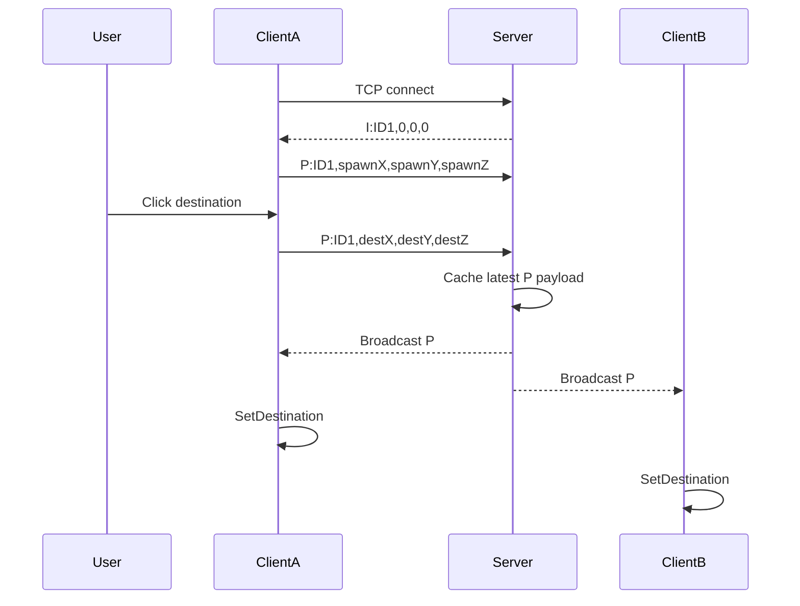

# IOCP Destination Sync — Code Portfolio

팀 Unity 프로젝트에서 직접 담당한 TCP 서버와 Unity 네트워크 클라이언트 코드를 선별한 코드 리뷰용 저장소입니다.

이 저장소는 실행 가능한 Unity 프로젝트가 아닙니다. Scene, Prefab, 외부 Asset, Unity 설정과 팀원 작성 코드는 포함하지 않습니다. `Source`와 `Evolution`의 C# 파일은 원본 Git commit의 blob을 수정 없이 복사했습니다.

## 핵심 사례

초기 구현은 Player의 현재 위치를 0.5초마다 서버에 전송했습니다. 그러나 수신 Client는 받은 좌표를 Transform 보정값이 아니라 `NavMeshAgent.SetDestination()`의 목적지로 사용하고 있었습니다.

이 의미 불일치를 기준으로 송신 대상을 다시 검토해, 주기적인 현재 위치 대신 마우스로 선택한 목적지를 입력 이벤트 시점에 전달하도록 변경했습니다.

```text
AS-IS
Current Position → every 0.5 seconds → Server → Broadcast → SetDestination

TO-BE
Click Destination → Server → Broadcast → SetDestination
```

성능이나 트래픽을 측정하지 않았으므로 이 변경을 "최적화"라고 표현하지 않습니다. 게임의 클릭 이동 방식에 맞춰 동기화 데이터의 의미와 전송 시점을 변경한 사례입니다.

## 코드 읽는 순서

1. [`Evolution/01_PositionSnapshot/NetworkManager.cs`](Evolution/01_PositionSnapshot/NetworkManager.cs) — 최초 위치 반복 전송
2. [`Evolution/02_DestinationSync/NetworkManager.cs`](Evolution/02_DestinationSync/NetworkManager.cs) — 클릭 목적지 전송으로 변경
3. [`Source/Client/NetworkManager.cs`](Source/Client/NetworkManager.cs) — 최종 Client 입력·파싱·Player 적용 흐름
4. [`Source/Server/Program.cs`](Source/Server/Program.cs) — ID 발급, Receive, 상태 저장, Broadcast
5. [`Source/UI/PlayerTextManager.cs`](Source/UI/PlayerTextManager.cs) — 채팅 입력과 Disconnect UI 연결

## Client–Server 흐름



## ID 관계

```text
Server
Player ID
├─ clientIdMap → Socket
└─ clientPositions → Latest P payload

Client
Player ID
└─ Players → GameObject
                ├─ NavMeshAgent
                └─ TextMeshPro
```

## 메시지 형식

| Type | 형식 | 역할 |
|---|---|---|
| `I:` | `I:ID,x,y,z` | ID 발급 및 기존 Player 초기화 |
| `P:` | `P:ID,x,y,z` | 초기 좌표 또는 클릭 목적지 전달 |
| `Text:` | `Text:ID,message` | 채팅 Broadcast |
| `Disconnected:` | `Disconnected:ID` | 명시적 연결 종료 전달 |

## Git 근거

| 단계 | Commit | 날짜 | 핵심 변화 |
|---|---|---|---|
| Position Snapshot | [`5bb4d1f`](https://github.com/DuckBaee/IOCP-Chat-Server/commit/5bb4d1f) | 2024-06-06 | 현재 위치를 0.5초마다 전송 |
| Destination Sync | [`3926262`](https://github.com/DuckBaee/IOCP-Chat-Server/commit/3926262) | 2024-06-06 | Coroutine 제거, 클릭 목적지 전송 |
| Selected Final | [`deadb7d`](https://github.com/DuckBaee/IOCP-Chat-Server/commit/deadb7d) | 2024-06-07 | 이동·채팅·Disconnect 통합 상태 |

상세 비교는 [`Docs/Position-To-Destination.md`](Docs/Position-To-Destination.md)를 참고합니다.

## 범위와 작성자

본인 Git 작성자:

- `DuckBaee <49149806+DuckBaee@users.noreply.github.com>`
- `Duckbaee <joy1655817@gmail.com>`

선별 기준점은 팀원의 캐릭터 표현 코드가 합쳐지기 전인 `deadb7d`입니다. 팀원 작성 `PlayerMove.cs`, Animation, 말풍선, 로그인·닉네임 코드는 포함하지 않았습니다.

상세 근거는 [`Docs/Code-Ownership.md`](Docs/Code-Ownership.md)를 참고합니다.

## 기술적 범위

- Unity 2022.3 프로젝트에서 작성된 Client 코드
- .NET 8 별도 TCP Server
- `SocketAsyncEventArgs` 기반 비동기 Socket 처리
- `TcpClient`, `NetworkStream`, `StreamReader`/`StreamWriter`
- `NavMeshAgent.SetDestination()`
- Player ID 기반 Socket·GameObject 매핑

`SocketAsyncEventArgs`를 사용한 프로토타입이며 native IOCP API를 직접 구현한 프로젝트로 설명하지 않습니다. Unity Netcode for GameObjects도 사용하지 않았습니다.

## 한계

원본 코드에는 TCP framing, identity validation, partial send, Socket별 send queue, position correction 등이 구현돼 있지 않습니다. 복사 코드는 역사적 증거 보존을 위해 수정하지 않았습니다.

상세 내용은 [`Docs/Limitations.md`](Docs/Limitations.md)를 참고합니다.

## 문서

- [`Architecture.md`](Docs/Architecture.md) — Client–Server 구조와 데이터 흐름
- [`Position-To-Destination.md`](Docs/Position-To-Destination.md) — 핵심 변경 과정
- [`Git-History.md`](Docs/Git-History.md) — 선별한 commit과 검증 방법
- [`Code-Ownership.md`](Docs/Code-Ownership.md) — 팀 프로젝트 작성자 구분
- [`Limitations.md`](Docs/Limitations.md) — 현재 구현의 기술적 한계
